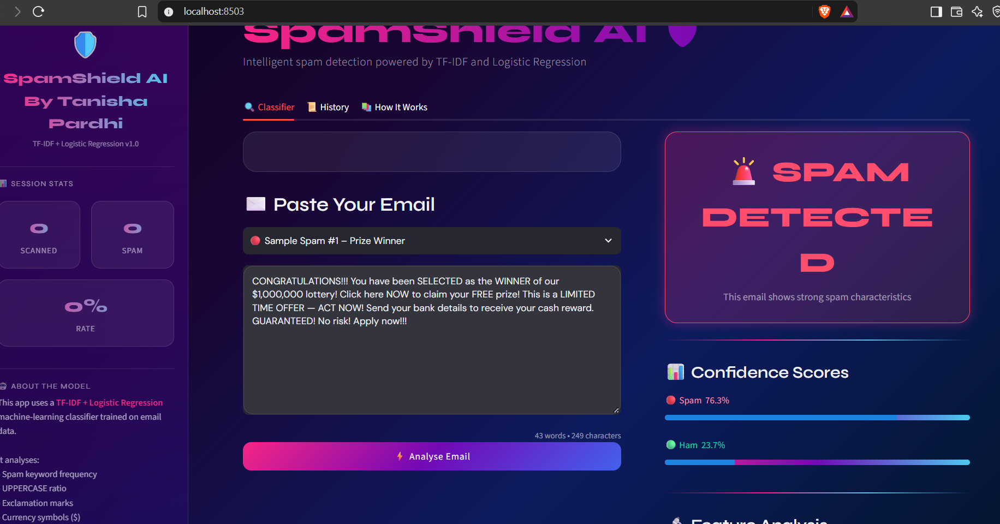

# 🛡️ SpamShield AI

An AI-powered spam email detection system built with **Python, Streamlit, and Machine Learning**.  

SpamShield AI analyzes email content and classifies messages as **Spam** or **Legitimate (Ham)**.

## 🚀 Features

- 📧 Spam vs. legitimate email classification
- 🤖 Machine Learning-based prediction
- 🔍 Email screenshot scanning using OCR
- 📊 Spam/legitimate confidence scores
- 📝 Scan history
- 📥 Downloadable scan reports
- 💻 Interactive Streamlit web interface
- 🛡️ Designed to help identify suspicious emails and phishing-style messages

## 🧠 Machine Learning

The project uses a supervised machine learning pipeline:

- **TF-IDF Vectorization** for converting email text into numerical features
- **Logistic Regression** for classification
- Training and testing data created from spam and legitimate email datasets

### Model Performance

The model was evaluated on a separate test set of **637 emails**.

| Metric | Result |
|---|---:|
| Test Accuracy | **95.76%** |
| Spam Precision | **99.1%** |
| Spam Recall | **80.6%** |
| Spam F1-Score | **89%** |

> Performance depends on the dataset and may differ on real-world emails.

## 📂 Project Structure

```text
SpamShield-AI/
│
├── app.py
├── train_model.py
├── train_ml_model.py
├── .gitignore
├── command.txt
└── SpamShield-AI.pdf
